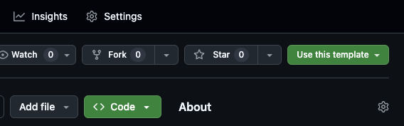

# Linq-it Vite React Template

This template provides a modern React setup with Vite, Material-UI (MUI), and ESLint configuration. It includes:

- **React 19** with Vite for fast development and building
- **Material-UI (MUI) v7** with dark theme pre-configured
- **ESLint** with React-specific rules and modern JavaScript support
- **Hot Module Replacement (HMR)** for instant development feedback
- **TypeScript support** ready to use
- **Emotion** for CSS-in-JS styling (used by MUI)

## Features

- ⚡ **Fast Development**: Vite provides instant server start and lightning-fast HMR
- 🎨 **Material-UI Integration**: Pre-configured with MUI components and dark theme
- 🔧 **ESLint Configuration**: Modern ESLint setup with React hooks and refresh plugins
- 📱 **Responsive Design**: Container and responsive components ready to use
- 🌙 **Dark Theme**: Beautiful dark theme configured by default
- 🏗️ **Modern Build**: Optimized production builds with Vite

## Getting Started

### Method 1: Using this template on GitHub

1. Click "Use this template" button on GitHub

   

2. Create a new repository from this template
3. Clone your new repository:
   ```bash
   git clone https://github.com/yourusername/your-new-project.git
   cd your-new-project
   ```

### Method 2: Manual setup

1. **Clone this template:**
   ```bash
   git clone https://github.com/linq-it/linqit-vite-template.git your-new-project
   cd your-new-project
   ```

2. **Remove the original git history and initialize a new repository:**
   ```bash
   rm -rf .git
   git init
   git add .
   git commit -m "Initial commit from linq-it template"
   ```

3. **Install dependencies:**
   ```bash
   npm install
   ```

4. **Customize your project:**
   - Update `package.json` with your project name and details
   - Replace `[Application title]` in `src/App.jsx` with your app name
   - Replace `[Browser tab title]` in `index.html` with your desired page title
   - Replace favicon and logo files in the `public/` directory

5. **Start development:**
   ```bash
   npm run dev
   ```

## Available Scripts

- `npm run dev` - Start development server with HMR
- `npm run build` - Build for production
- `npm run preview` - Preview production build locally
- `npm run lint` - Run ESLint to check code quality

## Project Structure

```
your-project/
├── public/
│   ├── favicon.ico          # Replace with your favicon
│   ├── logo192.png         # Replace with your logo
│   └── logo512.png         # Replace with your logo
├── src/
│   ├── assets/
│   │   └── react.svg       # Static assets
│   ├── App.jsx             # Main application component
│   └── main.jsx            # Application entry point
├── eslint.config.js        # ESLint configuration
├── index.html              # HTML template
├── package.json            # Dependencies and scripts
├── vite.config.js          # Vite configuration
└── README.md               # This file
```

## Customization

### Theming

The template includes a pre-configured dark theme. To customize:

1. **Modify the theme** in `src/App.jsx`:
   ```jsx
   const darkTheme = createTheme({
     palette: {
       mode: 'dark',
       primary: {
         main: '#your-primary-color',
       },
       // Add more customizations
     },
   });
   ```

2. **Switch to light theme**:
   ```jsx
   const lightTheme = createTheme({
     palette: {
       mode: 'light',
     },
   });
   ```

### Adding New Components

1. Create new components in `src/components/` (create this directory)
2. Import and use them in `App.jsx`
3. Take advantage of MUI's extensive component library

### Environment Variables

Create a `.env` file in the root directory for environment variables:
```
VITE_API_URL=https://api.example.com
VITE_APP_NAME=My App
```

Access them in your code:
```jsx
const apiUrl = import.meta.env.VITE_API_URL;
```

## Dependencies

### Core Dependencies
- `react` & `react-dom` - React library
- `@mui/material` - Material-UI components
- `@mui/icons-material` - Material-UI icons
- `@emotion/react` & `@emotion/styled` - CSS-in-JS library used by MUI

### Development Dependencies
- `vite` - Build tool and development server
- `@vitejs/plugin-react` - React plugin for Vite
- `eslint` - JavaScript linter
- `@types/react` & `@types/react-dom` - TypeScript definitions

## Next Steps

After setting up your project:

1. **Plan your application structure** - Consider creating folders for components, pages, hooks, utils, etc.
2. **Set up routing** - Consider adding React Router for navigation
3. **State management** - Add Redux, Zustand, or Context API as needed
4. **API integration** - Set up axios or fetch for API calls
5. **Testing** - Add Jest, React Testing Library, or Vitest
6. **Deployment** - Configure for your preferred hosting platform

## Contributing

This template is maintained by the Linq-it team. Feel free to submit issues and enhancement requests!

## License

This template is available under the MIT License.


